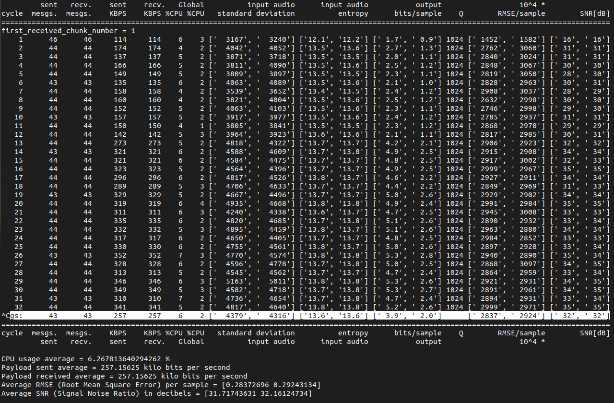
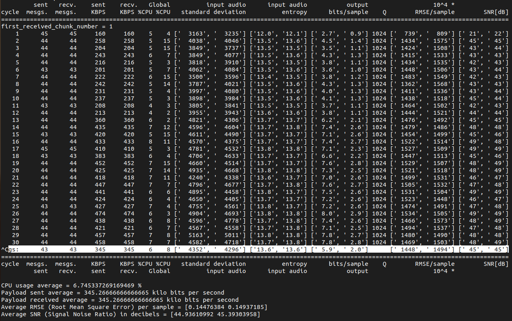
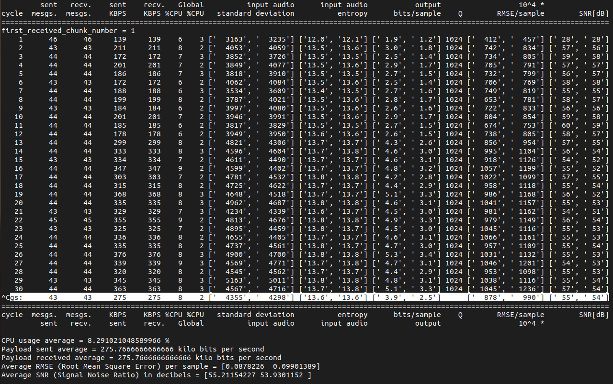
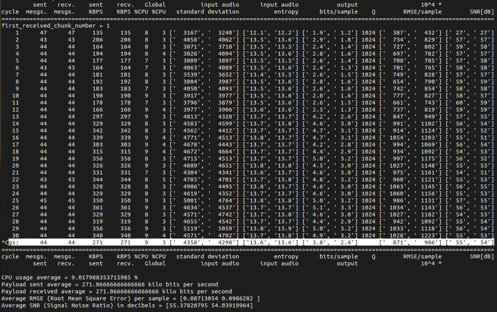
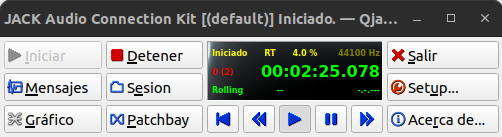
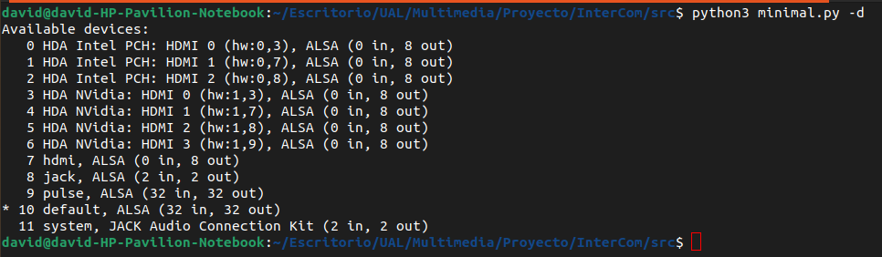
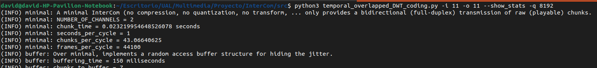
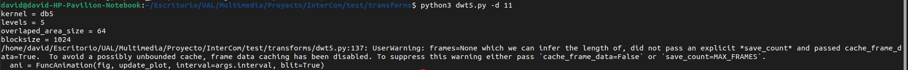
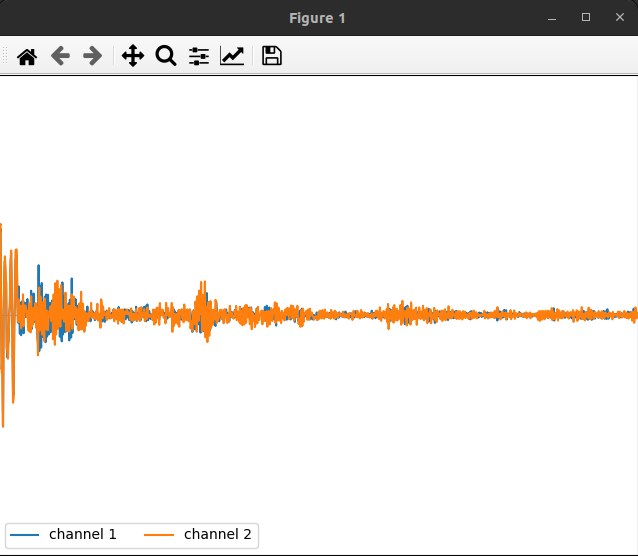

# Hito 7. Transform Coding for Redundancy Removal

## Alumnos: David Pérez Pérez, Jose Cabrera Pérez, Jesús David Martínez Valdés y Tomás García Tobarra.

## RD Curves (MST16, MST32, DWT-no-overlapped, DWT-overlapped)

Para determinar las curvas RD de los 4 scripts, vamos a establecer el parámetro -q (--minimal_quantization_step parameter) en 1024 para empeorar la calidad y poder observar mejor luego los cambios en las gráficas. El valor del parámetro se mantiene para los 4 códigos de tal manera que se pueda posteriormente comparar mejor los resultados. También indicar que se usará en todos los scripts el mismo archivo de audio.

## MST16

Para este script, lo ejecutamos de la siguiente manera python3 stereo_MST_coding_16.py --show_stats -f ../data/AviadorDro_LaZonaFantasma.oga -q 1024.

Obteniendo la siguiente salida:

## MST32

Para este script, lo ejecutamos de la siguiente manera python3 stereo_MST_coding_32.py --show_stats -f ../data/AviadorDro_LaZonaFantasma.oga -q 1024.

Obteniendo la siguiente salida:

## DWT-no-overlapped

Para este script, lo ejecutamos de la siguiente manera python3 temporal_no_overlapped_DWT_coding.py --show_stats -f ../data/AviadorDro_LaZonaFantasma.oga -q 1024.

Obteniendo la siguiente salida:

## DWT-overlapped

Por último, el script de DWT-overlapped que ejecutamos de la siguiente manera: python3 temporal_overlapped_DWT_coding.py --show_stats -f ../data/AviadorDro_LaZonaFantasma.oga -q 1024.

Obteniendo la siguiente salida:

## Comparación Resultados

Una vez obtenida todas las salidas lo siguiente es quedarnos con los datos que nos interesan de la tabla que son el RMSE/sample y los KBPS para representar una gráfica en conjunto de los resultados de la ejecución de los 4 scripts y poder comparar los resultados.

## Visualize

Para poder ver el efecto de la cuantización en directo necesitamos:
    - Ejecutar (y dejar en segundo plano) una instancia de qjackctl.
    - Conocer (tras ejecutar qjackctl) cuáles son los dispositivos de audio de nuestro pc y su identificador.
    - Ejecutar el código temporal_overlapped_DWT_coding.py con los parámetros -i y -o
    - Ejecutar (de la carpeta de test/transform) el código dwt5.py con el parámetro -d

Con los parámetros -i y -o indicamos el id del dispositivo de audio del que vamos a hacer uso (-i para la entrada y -o para la salida). Con -d lo mismo. El objetivo es comunicar la salida del temporal_overlapped_DWT_coding.py con la entrada del dwt5.py de tal manera que podamos ver en la gráfica de salida del dwt5.py el resultado de la cuantización en directo de todo sonido que entre por el micrófono de mi ordenador.

