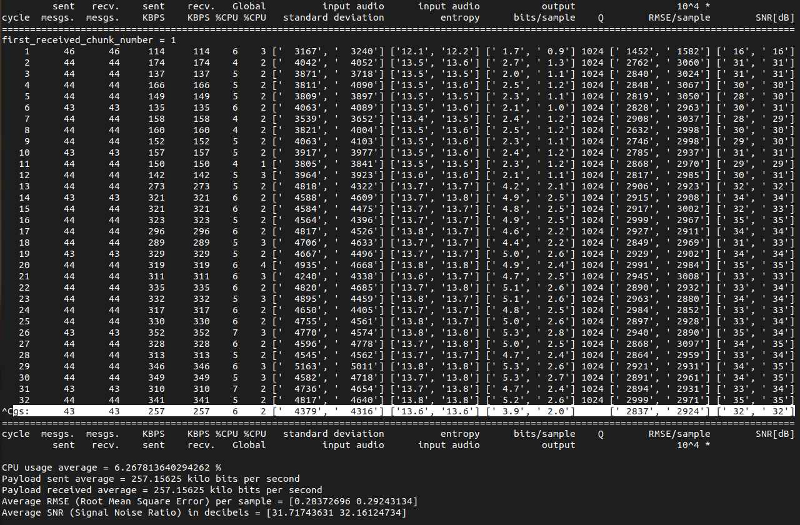
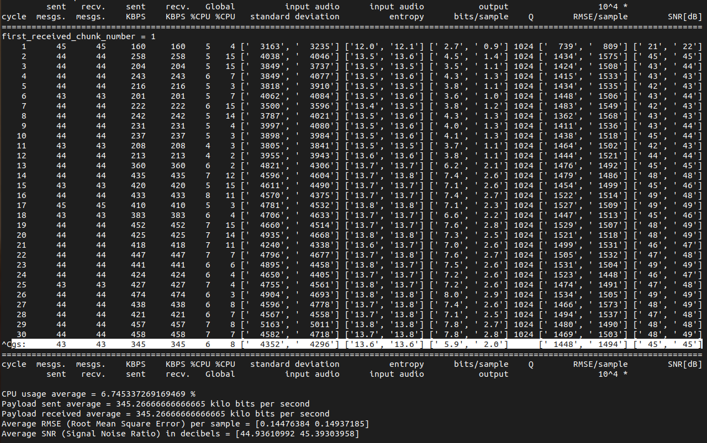
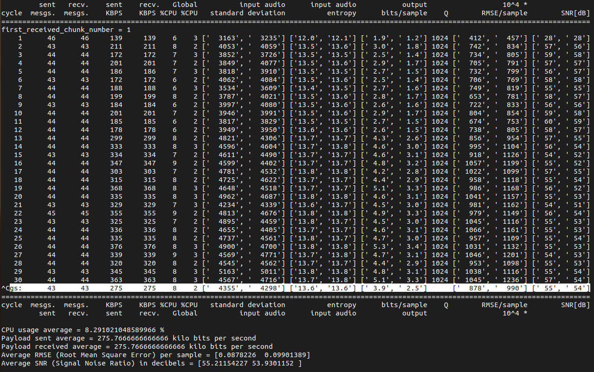
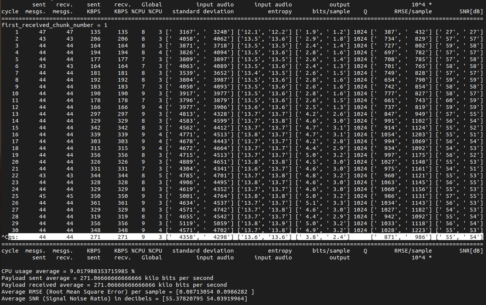
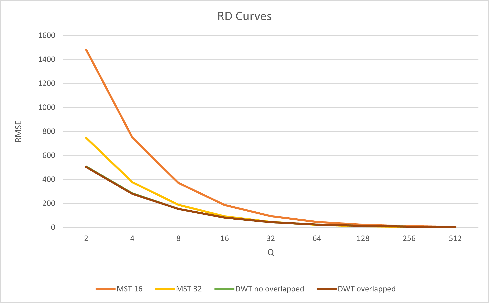
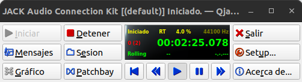
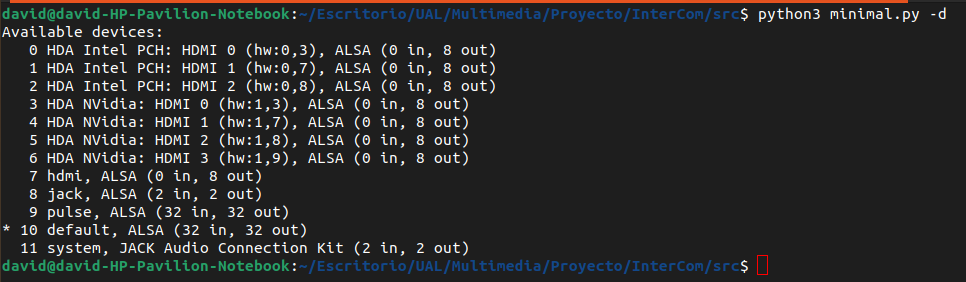
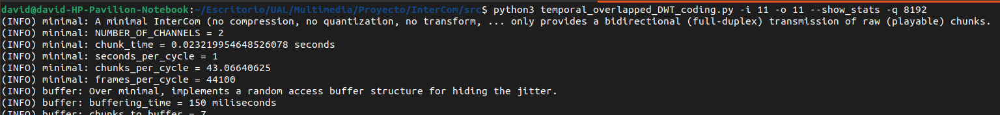
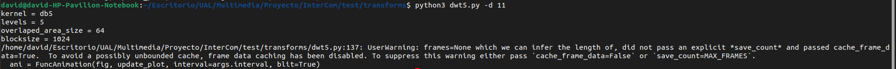
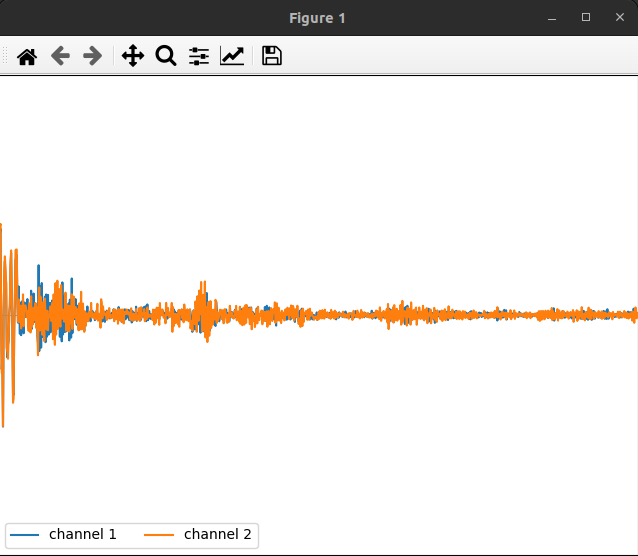

# Hito 7. Transform Coding for Redundancy Removal

## Alumnos: David Pérez Pérez, Jose Cabrera Pérez, Jesús David Martínez Valdés y Tomás García Tobarra.

## RD Curves (MST16, MST32, DWT-no-overlapped, DWT-overlapped)

Para determinar las curvas RD de los 4 scripts, vamos a establecer el parámetro -q (--minimal_quantization_step parameter) en 1024 para empeorar la calidad y poder observar mejor luego los cambios en las gráficas. El valor del parámetro se mantiene para los 4 códigos de tal manera que se pueda posteriormente comparar mejor los resultados. También indicar que se usará en todos los scripts el mismo archivo de audio.

## MST16

Para este script, lo ejecutamos de la siguiente manera python3 stereo_MST_coding_16.py --show_stats -f ../data/AviadorDro_LaZonaFantasma.oga -q 1024.

Obteniendo la siguiente salida:

## MST32

Para este script, lo ejecutamos de la siguiente manera python3 stereo_MST_coding_32.py --show_stats -f ../data/AviadorDro_LaZonaFantasma.oga -q 1024.

Obteniendo la siguiente salida:

## DWT-no-overlapped

Para este script, lo ejecutamos de la siguiente manera python3 temporal_no_overlapped_DWT_coding.py --show_stats -f ../data/AviadorDro_LaZonaFantasma.oga -q 1024.

Obteniendo la siguiente salida:

## DWT-overlapped

Por último, el script de DWT-overlapped que ejecutamos de la siguiente manera: python3 temporal_overlapped_DWT_coding.py --show_stats -f ../data/AviadorDro_LaZonaFantasma.oga -q 1024.

Obteniendo la siguiente salida:

## Comparación Resultados

Una vez obtenida todas las salidas lo siguiente es quedarnos con los datos que nos interesan de la tabla que son el RMSE/sample y los KBPS para representar una gráfica en conjunto de los resultados de la ejecución de los 4 scripts y poder comparar los resultados.

## Cuestiones

    - Which has been the gain of the filters used in your experiments?

Mayor limpieza de la señal: Valores más altos de SNR indican una mayor relación entre la señal deseada y el ruido presente en la señal. En este caso, la DWT tiene el SNR más alto, lo que sugiere una mayor limpieza en la señal después del procesamiento de compresión.

Mejora de la calidad de la señal: Al igual que se mencionó antes, valores más altos de SNR suelen estar asociados con una mejor calidad percibida de la señal de audio. Por lo tanto, la DWT podría estar conservando mejor la calidad del audio en comparación con las transformadas MST de órdenes menores (MST32 y MST16).

Eficiencia de compresión: La relación entre la señal y el ruido puede ser un indicador de la eficiencia de la compresión. Un SNR más alto después de la compresión sugiere que la técnica utilizada para la compresión (en este caso, la DWT) logra preservar mejor la señal deseada mientras reduce el ruido.

    - Which other transform(s) are used in audio encoding systems (such as MP3) to exploit temporal redundancy? Enumerate the systems and the transform(s) used. 

Transformada de coseno discreto (DCT, por sus siglas en inglés). La DCT se utiliza para aprovechar la redundancia temporal en señales de audio. MP3, por ejemplo, utiliza DCT para transformar los datos de audio en el dominio de la frecuencia, luego cuantifica y codifica estos coeficientes para la compresión de audio

## Visualize

Para poder ver el efecto de la cuantización en directo necesitamos:
    - Ejecutar (y dejar en segundo plano) una instancia de qjackctl.
    - Conocer (tras ejecutar qjackctl) cuáles son los dispositivos de audio de nuestro pc y su identificador.
    - Ejecutar el código temporal_overlapped_DWT_coding.py con los parámetros -i y -o
    - Ejecutar (de la carpeta de test/transform) el código dwt5.py con el parámetro -d

Con los parámetros -i y -o indicamos el id del dispositivo de audio del que vamos a hacer uso (-i para la entrada y -o para la salida). Con -d lo mismo. El objetivo es comunicar la salida del temporal_overlapped_DWT_coding.py con la entrada del dwt5.py de tal manera que podamos ver en la gráfica de salida del dwt5.py el resultado de la cuantización en directo de todo sonido que entre por el micrófono de mi ordenador.

## Conclusión

En este último experimento podemos tener en cuenta varios aspectos:
    - Podemos ver como funciona en tiempo real una gráfica que muestra la salida ya procesada sobre el sonido que estamos produciendo.
    - Con los resultados del script podemos evaluar la calidad de la señal tanto por la distorsión RMSE como la relación SNR
